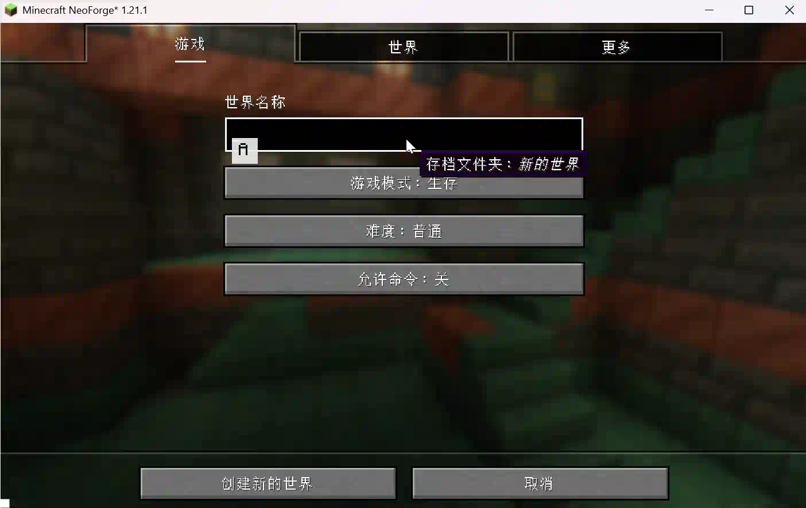
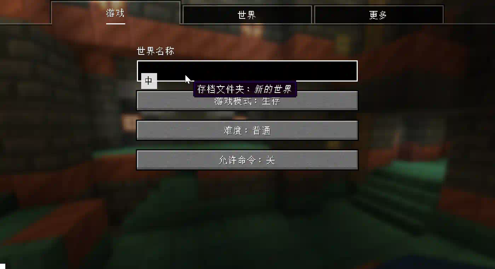
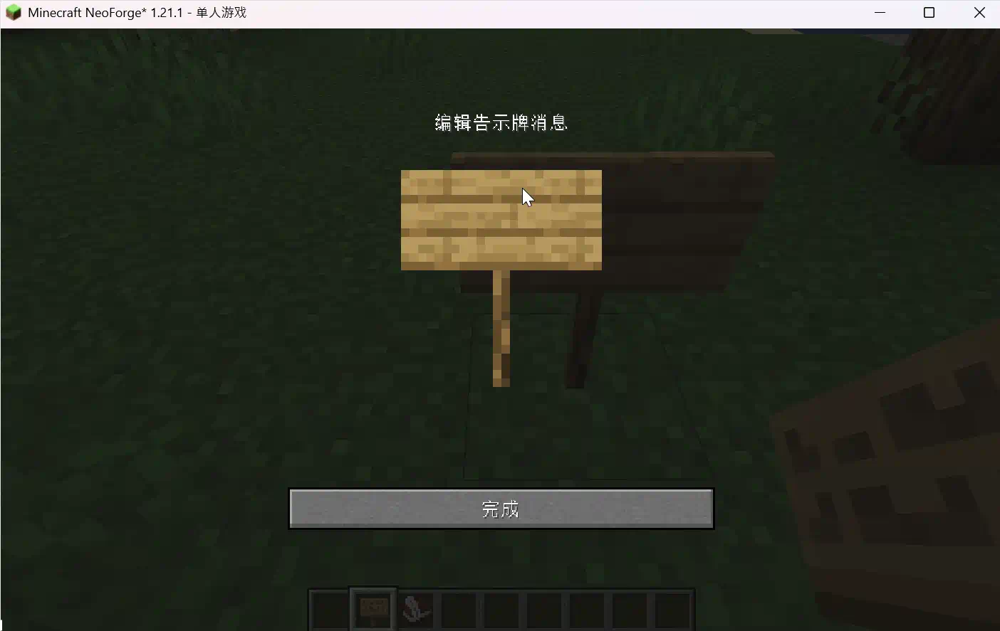
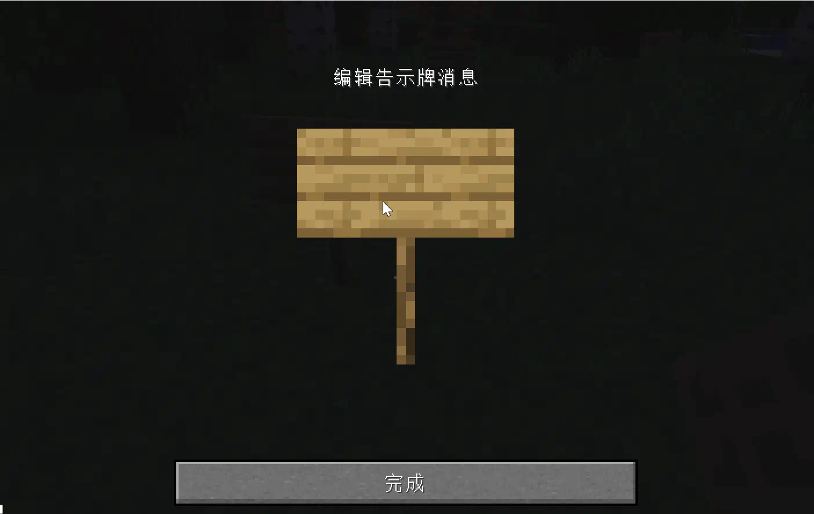
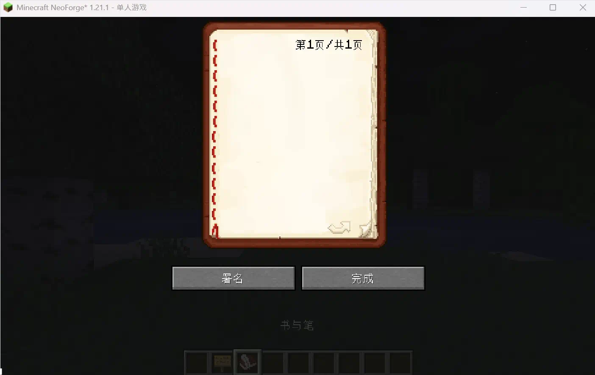
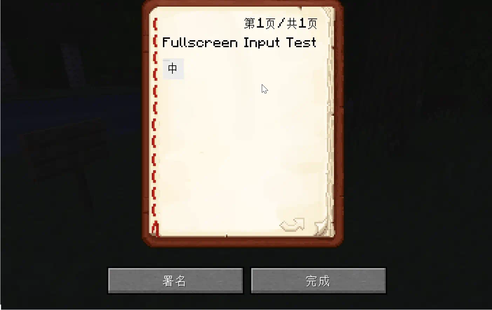

# ContingameIME-Neo Gallery & Demos

## Dynamic Previews (GIFs)

> **Note:** This page contains animated demonstrations of various input scenarios.
> **注意：** 本页面包含各种输入场景的动态演示。

### Window Mode (窗口模式)

### Fullscreen Mode (全屏模式)

### Sign Input (窗口告示牌输入)

### Sign Input (全屏告示牌输入)

### Book Input (窗口书本输入)

### Book Input (全屏书本输入)

