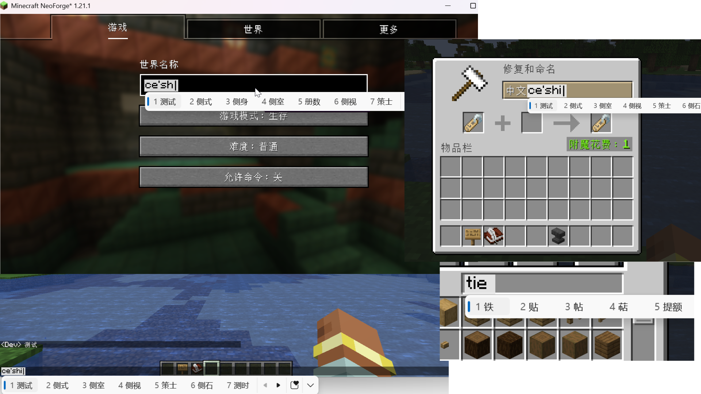
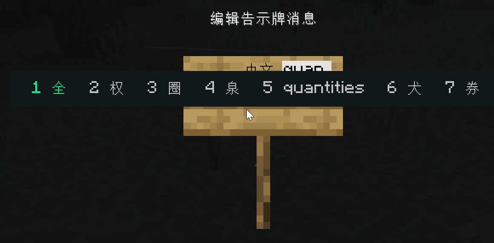
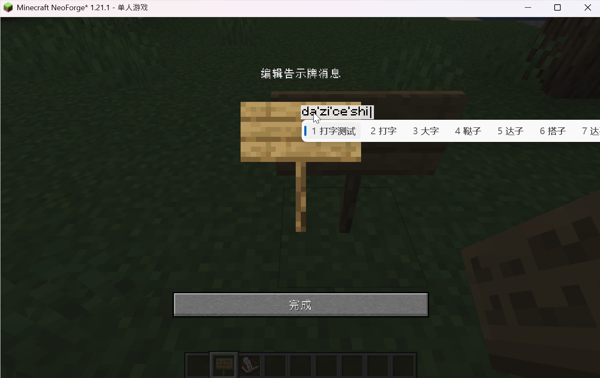
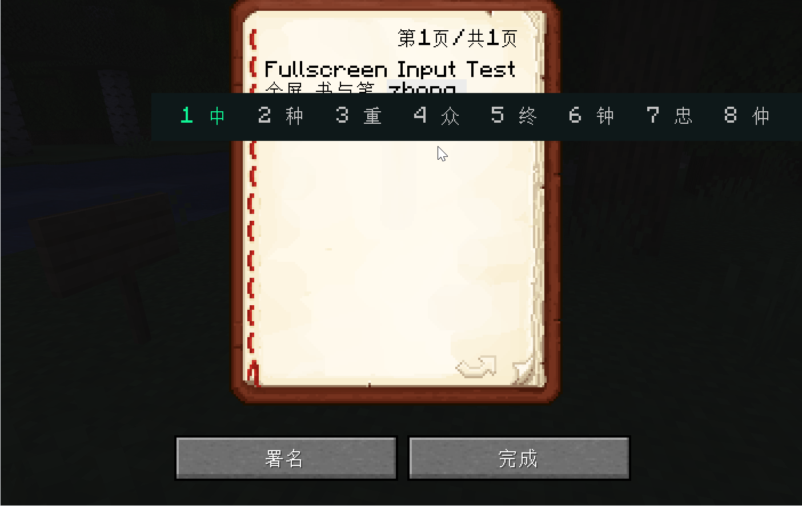
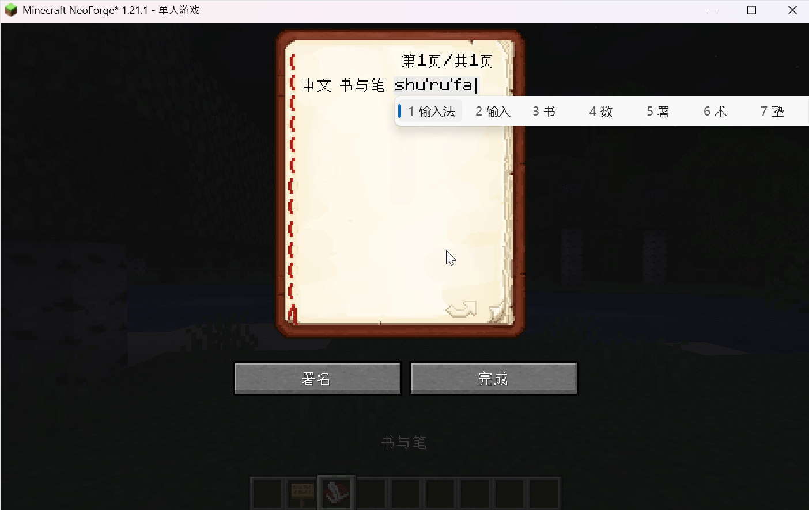
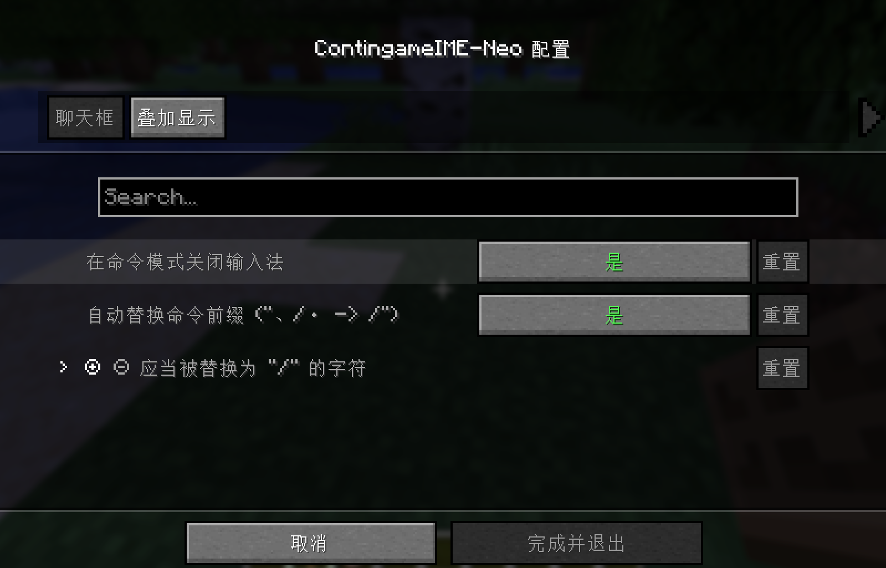
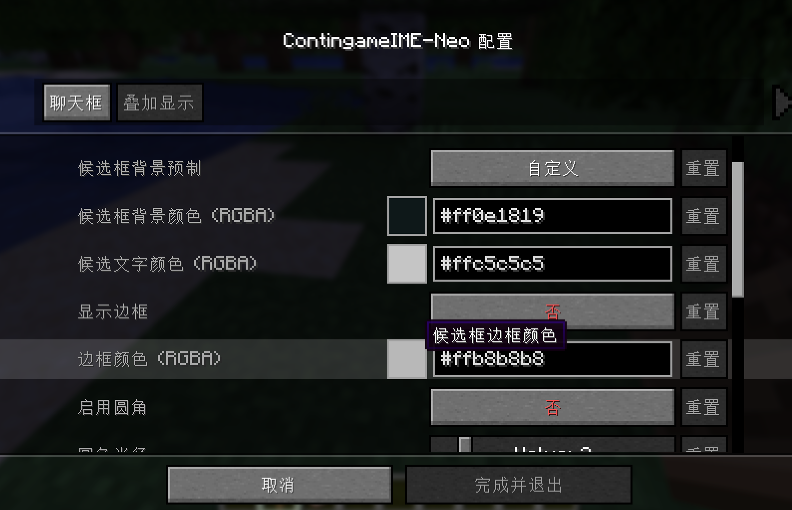
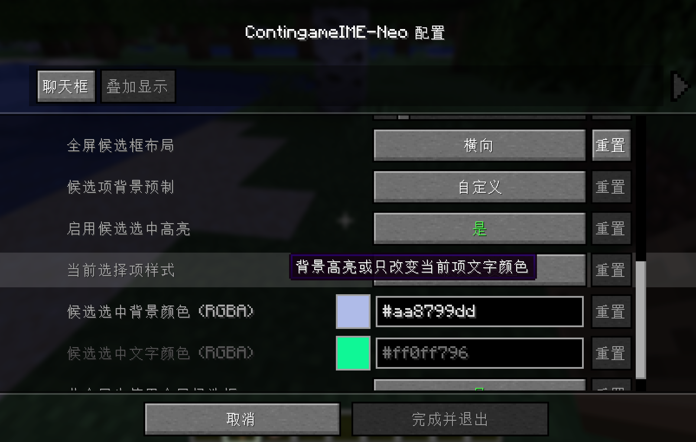

# ContingameIME-Neo (Maintenance Fork)

本模组是 [XPlus-ContingameIME](https://github.com/Wudji/XPlus-ContingameIME) 的后续维护版本（非官方 NeoForge 移植），并在此基础上参考 [IngameIME](https://github.com/Windmill-City/IngameIME-Minecraft) 持续开发；

同时引入 Windmill-City 作者本人编写使用的 JNI 库源码并以 git submodules 管理，找回 JNI DLL 源代码与构建参数、重构项目目录，以增强可维护性。在全屏的Minecraft中使用输入法，并在原版基础上进行了一些修复和改进。

**注意：本版本仅支持 NeoForge 平台。支持 Fabric 的版本请访问 [原项目](https://github.com/Wudji/XPlus-ContingameIME)**

ZH-CN / [EN-US](README-EN.md)

# 特色

- 现在可以在 NeoForge loader (Minecraft 1.21-1.21.3) 上使用本模组。
- 输入法语言不再直接检测客户端语言，而是检测实际输入法。
- 候选框选中项高亮显示，高亮颜色可在配置中自定义。
- 修复了切换全屏重启后 IME 候选框不显示的 bug。
- 修复安装 Caxton 和 Modern UI 后输入框不跟随光标的 bug。

# 图片展示

### 窗口模式演示

### 全屏模式演示

### 多场景输入适配 (Input Styles)

即使在特殊的界面中，输入法也能完美融合。

> 🎥 **查看动态演示 / View Animated GIFs:** [GALLERY.md](GALLERY.md)

|  | 全屏 (Fullscreen) | 窗口 (Windowed) |
| :---: | :---: | :---: |
| **告示牌 (Sign)** |  |  |
| **书本 (Book)** |  |  |

# 按键切换

- 单击快捷键，在**临时输入状态**和**关闭状态**之间切换
- 双击快捷键，切换到**开启模式**。
- 当鼠标移动并有事情发生时，**临时输入状态**切换到**关闭状态**。

### 配置预览 (Configuration)

本模组提供了丰富的自定义选项，支持自定义候选框背景色、高亮色、边框样式等。

    
    
    

# 构建指南

- 参见 [BUILD_GUIDE.md](BUILD_GUIDE.md)

## 依赖

- NeoForge
  - [Kotlin for NeoForge](https://www.curseforge.com/minecraft/mc-mods/kotlin-for-forge)
  - [Cloth Config API (NeoForge)](https://www.curseforge.com/minecraft/mc-mods/cloth-config)
  - [Architectury API (NeoForge)](https://www.curseforge.com/minecraft/mc-mods/architectury-api)

- 系统运行库
  - [Microsoft Visual C++ Redistributable (VCRuntime141)](https://learn.microsoft.com/zh-CN/cpp/windows/latest-supported-vc-redist)

# 测试环境

本模组已在以下输入法环境下测试：
- 微软拼音输入法
- Japanese IME（日语输入法）

其他输入法可能也能正常工作，但未经全面测试。

# 代码使用/引用
- [Windmill-City/IngameIME-Minecraft](https://github.com/Windmill-City/IngameIME-Minecraft) (LGPL-2.1)
- [Windmill-City/IngameIME](https://github.com/Windmill-City/IngameIME) (LGPL-2.1)
- [Wybxc/IngameIME-Minecraft](https://github.com/Wybxc/IngameIME-Minecraft) (LGPL-2.1)
